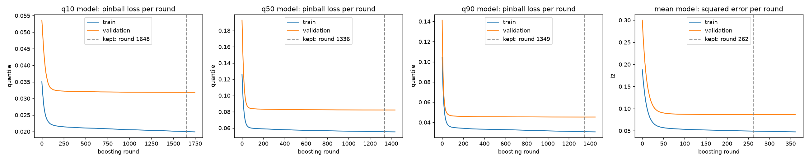
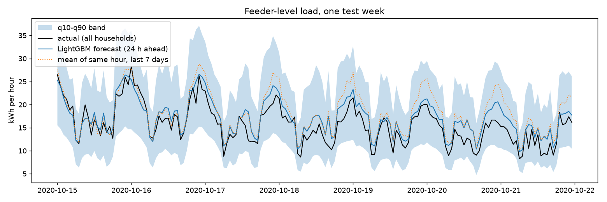

# AETHERGRID Ω


**Adaptive Energy & Thermal Ecosystem for Hierarchical Grid Intelligence**

AI-based electricity demand optimization for smart buildings — a
closed-loop digital twin and hierarchical control system spanning three
scales: a single **building**, a **colony** (constrained microgrid with a
critical-load priority hierarchy and resilience mode), and a **connection**
layer that discovers and economically validates (or rejects) coordination
opportunities between buildings.

> Most systems optimize the building. AETHERGRID forecasts with
> uncertainty, controls with a safety shield in front of every action,
> discovers when buildings can help each other, and proves — via a
> deterministic bill engine and a perfect-foresight oracle — whether every
> intervention was actually worth it.

## Real-data results: day-ahead load forecasting on 84 Indian households

The forecaster's approach (LightGBM quantile regression) is benchmarked on **real smart-meter
data**. It forecasts every household's hourly electricity use 24 hours ahead, then the
feeder total.

| | |
|---|---|
| Load data | CEEW high-frequency smart meters, Mathura and Bareilly, Uttar Pradesh: 84 households (46 Bareilly, 38 Mathura), 3-minute readings aggregated to 1,069,869 household-hours, 2019-05-01 → 2021-10-31 ([Harvard Dataverse doi:10.7910/DVN/GOCHJH](https://doi.org/10.7910/DVN/GOCHJH), CC0) |
| Weather | Open-Meteo historical archive (ERA5-based, CC BY 4.0): hourly temperature, humidity and solar radiation for each city |
| Outages | 71,106 household-hours had no grid supply; they are excluded from training targets and scoring |
| Split | train 2019-05-08 → 2020-06-30 (451,426 rows) · validation 2020-07-01 → 2020-09-30 (94,088) · **test 2020-10-01 → 2021-10-31 (258,100)** |
| Inputs | load 24 h, 48 h and 168 h earlier, same-hour mean of the past 7 days, the 24 h window ending a day earlier, calendar, household scale, city, weather |

Observed weather stands in for a day-ahead weather forecast, which makes the weather
inputs slightly optimistic. Every load input is at least 24 hours old.

**Feeder level (all households summed per hour), the load a distribution company
schedules day-ahead:**

| Method | MAE (kWh/h) | RMSE | WAPE | Absolute error per day | Daily peak hour within ±1 h |
|---|---|---|---|---|---|
| **LightGBM (mean model)** | **1.2391** | **1.6566** | **12.69%** | **29.74 kWh** | **64.1%** |
| Same hour yesterday | 1.4029 | 1.9137 | 14.37% | 33.67 kWh | 55.1% |
| Mean of same hour, last 7 days | 1.4729 | 1.9827 | 15.09% | 35.35 kWh | 58.1% |
| Same hour last week | 2.0704 | 2.8132 | 21.21% | 49.69 kWh | 51.0% |

The LightGBM forecast cuts the day-ahead scheduling error by **11.7%** against the best
naive method (29.74 vs 33.67 kWh/day over 396 test days). It also finds the daily peak
hour on 64.1% of days, against 55.1%.

**Household level (each home, each hour):**

| Method | MAE (kWh) | RMSE | WAPE | Bias |
|---|---|---|---|---|
| **LightGBM q50 (median)** | **0.1298** | 0.2680 | **36.09%** | −0.0388 |
| LightGBM mean model | 0.1383 | **0.2613** | 38.47% | −0.0026 |
| Mean of same hour, last 7 days | 0.1409 | 0.2731 | 39.18% | 0.0055 |
| Same hour yesterday | 0.1530 | 0.3190 | 42.54% | 0.0012 |
| Same hour last week | 0.1846 | 0.3719 | 51.36% | 0.0098 |

A single home's hour-to-hour use is noisy (WAPE above 36% for every method). The median
model has the lowest MAE, 7.9% below the best baseline. The q10-q90 band contains 75.96%
of actual values against a nominal 80%, so the intervals are slightly too narrow. Pinball
losses: q10 0.0229, q50 0.06488, q90 0.04042.

Medians don't add up: summing households' q50 forecasts under-predicts the feeder total
(bias −1.05 kWh/h). That's why the feeder forecast uses the mean model.

Training stopped by validation loss: q10 at round 1,648, q50 at 1,336, q90 at 1,349, and
the mean model at 262.




Reproduce (downloads about 1 GB from Harvard Dataverse, then about 3 minutes of training):

```bash
python -m aethergrid.realdata.ceew --out data/ceew
python -m aethergrid.realdata.forecast_benchmark --ceew-dir data/ceew
```

Full numbers: `reports/ceew_forecast_metrics.json`. The rest of this README describes the
closed-loop system, which runs on simulated buildings (see `docs/LIMITATIONS.md`).

## Quick start

```bash
pip install -r requirements.txt
python -m pytest -q

python -m aethergrid.run --world society --scenario aethergrid/configs/worlds/society.json
python -m aethergrid.run --world colony --scenario aethergrid/configs/worlds/colony.json
python -m aethergrid.run --world connection --scenario aethergrid/configs/worlds/connection.json

python -m aethergrid.evaluate --all
streamlit run aethergrid/ui/app.py
```

See `docs/DEMO.md` for a guided walkthrough and `docs/EXPERIMENTS.md` for
what each command produces.

## Architecture (short version)

```
JSON world/tariff/event  ->  World/Building (RC thermal + storage physics)
        -> EnergyDNA (interpretable signatures) + Flexibility Map
        -> Forecast (LightGBM quantile regression, calibrated)
        -> Chance-constrained rolling-horizon MPC (PuLP/CBC LP)
           [+ RL policy, comparison arm]
        -> Safety Shield (hard-bound projection, RULE 3, always on)
        -> Digital Twin physics step
        -> BillEngine (deterministic financial ground truth)
        -> Evaluation (8 baselines, Oracle, ablation, robustness, reports)
```

Full diagram and module-by-module responsibilities: `docs/ARCHITECTURE.md`.

## Why this shape

Classical chance-constrained MPC, not reinforcement learning, is the
primary controller here. Across CityLearn 2021–2023 at NeurIPS, no
top-performing team used RL for building-energy scheduling; winning
entries used classical optimization and hierarchical forecast+MPC
composition — reportedly because no training environment (a hackathon has
even less of one than a competition) is rich enough for RL to out-learn a
well-specified optimizer. AETHERGRID trains a PPO policy anyway, as a
secondary comparison arm, specifically to test that finding in this
environment rather than assume it. See `docs/METHODOLOGY.md`.

The one mechanical idea that does the real work: the MPC solves the exact
same LP whether it's given the mean forecast or a conservative quantile
(q95 demand / q05 solar) — chance-constrained control is a one-line
substitution (`optimization/chance_constraints.py`), which is what makes
the uncertainty-vs-mean comparison in the results table a fair,
apples-to-apples test rather than two different optimizers.

## The five research hypotheses

| | Hypothesis | Where it's tested |
|---|---|---|
| H1 | Uncertainty-aware forecasting reduces costly peak-demand violations vs mean-only forecasting | `mean_mpc` vs `quantile_mpc`, `evaluation/baselines.py` |
| H2 | Hierarchical coordination beats independent building optimization | `society` vs `colony`/`connection` worlds, `simulation/colony.py`, `synergy/counterfactual.py` |
| H3 | Adaptive RL improves performance under distribution shift vs a static policy | `rl`/`safe_rl` vs `quantile_mpc` under stress, `evaluation/robustness.py` |
| H4 | Cross-building synergy discovery finds opportunities independent optimization can't see | `graph/graph.py`, `synergy/discovery.py` |
| H5 | A safety-constrained hybrid beats unconstrained RL on cost/comfort/resilience | `evaluation/ablation.py:FULL_minus_safety_shield` |

None of these are assumed true going in — see `docs/METHODOLOGY.md` for
how each is actually falsifiable, and `docs/generated/` (produced by
`python -m aethergrid.evaluate --all`) for the real numbers.

## What is measured / simulated / assumed / learned / optimized / NOT modeled

Full claim-discipline statement, including the specific things this build
deliberately did NOT do given a single-session time budget (real meter data
inside the control loop, multi-agent RL, a GNN, physical energy transfer between most
building pairs, an LLM anywhere in the money path): **`docs/LIMITATIONS.md`**.
Read this before quoting any number from this project.

## Repository layout

```
aethergrid/
  configs/{worlds,tariffs,experiments}/   JSON scenario definitions
  schemas/          Pydantic schemas (world, building, tariff, event, experiment)
  core/             World/Building/resources, weather, the reusable simulation loop
  energy_dna/       Interpretable building signatures + flexibility map
  forecasting/      Quantile ML forecaster, calibration, MPC's fast path forecaster
  tariff/           Tariff compiler, validator, BillEngine (financial ground truth)
  simulation/       RC thermal, storage, electrical, grid, colony orchestration
  optimization/     MPC (LP), chance constraints, safety shield, constraints
  rl/               Gymnasium env, PPO training/eval, deterministic fallback policy
  graph/            Energy Opportunity Graph (NetworkX + engineered features)
  synergy/          Discovery, technical/economic feasibility, counterfactual test
  stress/           Adversarial event injectors (heatwave, outage, sensor dropout, ...)
  evaluation/       Baselines, Oracle, metrics, ablation, robustness, experiment runner, reports
  ui/                Streamlit one-screen dashboard
  tests/            pytest suite (reproducibility, safety, bill-matches-hand-calc, ...)
  run.py            `python -m aethergrid.run --world ... --scenario ...`
  evaluate.py       `python -m aethergrid.evaluate --all`
docs/
  ARCHITECTURE.md   Component/data-flow/control-flow diagrams
  METHODOLOGY.md    Hypotheses, why MPC over RL, weight calibration rationale
  EXPERIMENTS.md    How to run and reproduce every reported number
  LIMITATIONS.md    Claim discipline: measured / simulated / assumed / not modeled
  DEMO.md           Guided walkthrough script
```

## Stack

Python 3.11 · NumPy/Pandas/scikit-learn · LightGBM (quantile regression) ·
PuLP+CBC (LP) · Gymnasium + stable-baselines3 (PPO) · NetworkX · Plotly ·
Streamlit · Pydantic
